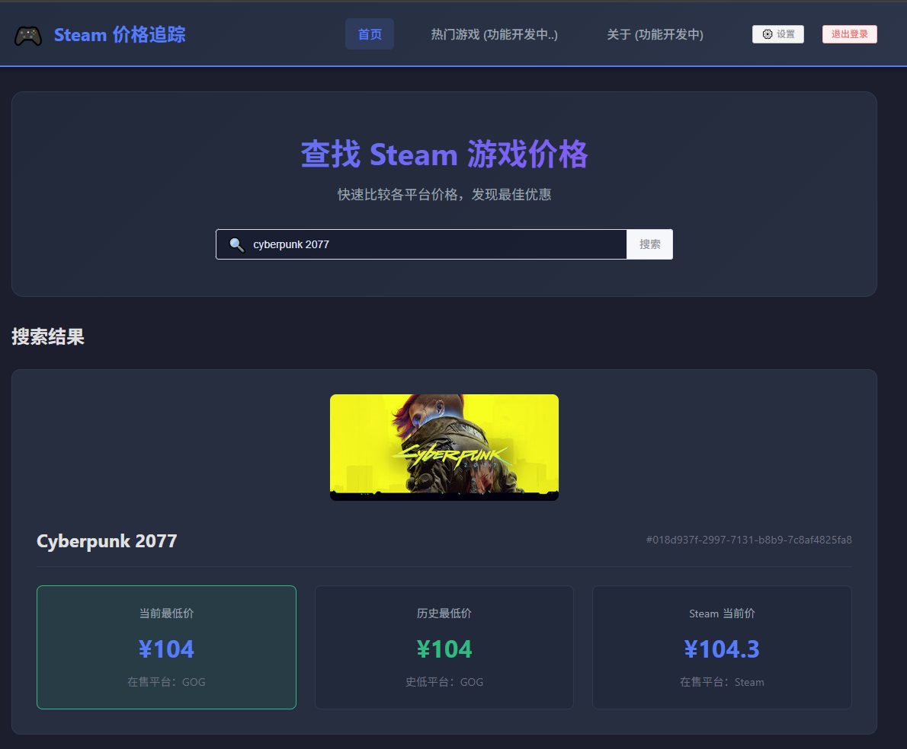

# Steam Game Price Bot | Steam 游戏价格助手 🎮

**基于 IsThereAnyDeal API，快速查询 Steam 游戏全网比价**

[ENGLISH](./README_EN.md)

---

## 📖 项目简介

Steam 游戏价格助手是一个全栈式的游戏价格查询系统，基于 **IsThereAnyDeal** 平台接口进行二次开发实现。通过简洁直观的前端界面，用户可以快速查询 Steam 游戏在各大游戏平台的价格信息，包括当前最低价、历史最低价、Steam 当前价等，帮助玩家发现最佳购买时机。更多功能持续开发实现中，欢迎大家提出想法与建议，也欢迎大家成为项目的贡献者。  

项目近期更新日志：[update.txt](./update.txt)

## ❓ 使用有疑问？
- 如果你有使用上的疑问或是遇到了问题，请点击👉 [问题issue区](https://github.com/flh155/SteamGamePriceSpider/issues) 进行提问

- 如果你对项目有什么建议或意见，或是想要发帖与其它使用者讨论交流，请点击👉 [讨论discussions区](https://github.com/flh155/SteamGamePriceSpider/discussions) 进行发帖讨论

- 如果你也是开发者，想要成为项目的开发贡献者之一，请点击👉[PR提交区](https://github.com/flh155/SteamGamePriceSpider/pulls) 提交起你的功能开发优化项
---
### ✨ 特性亮点

- 🔍 **实时比价** - 一键查询游戏在多个平台的价格信息
- 💰 **价格追踪** - 显示当前优惠价和历史最低价，辅助购买决策
- 🎯 **精准搜索** - 支持游戏英文名称模糊匹配
- 🔐 **安全认证** - 完整的用户认证体系，密码 AES 加密存储
- 📱 **响应式设计** - 适配桌面和移动端，现代化 UI 界面
- 🐳 **容器化部署** - 支持 Docker Compose 一键部署

---

## 🚀 主要功能

### 1. 游戏价格查询
- 输入游戏名称（现阶段暂时只支持英文名）
- 获取全网各平台实时价格对比
- 展示当前最低价、历史最低价、Steam 当前价  

### 2. 热门特惠推荐（开发中）
- 自动展示当前热门折扣游戏列表
- 按热度排序，发现优质特价游戏
- 点击直达游戏价格详情

### 3. 更多功能还在开发中...

---
## 📋 后续功能开发计划  

### 1. 全网慈善包追踪
- 自动爬取如HumbleBundle等平台在售的慈善包信息  
- 自动比价计算慈善包优惠力度

### 2. 心愿单游戏追踪
- 可设置关注的游戏清单
- 当心愿单中的游戏在全网平台出现促销或是史低时发送通知
---
## ⚡ 快速开始

### 1. 准备工作
确保已安装 Docker 和 Docker Compose。

### 2. 拉取最新项目main分支代码  
使用命令 `git clone https://github.com/flh155/SteamGamePriceSpider.git` 拉取本项目最新代码

### 3. 使用docker构建启动项目  
进入项目代码根目录，使用命令 `docker compose up -d --build` 构建启动本项目，首次构建可能需要几分钟时间。

### 4. 申请 `IsThereAnyDeal` API KEY  
到 [IsThereAnyDeal](https://isthereanydeal.com/apps/) 官网创建账号登录，创建一个app，获取到app的API-KEY

### 5. 访问前端页面使用
项目完成构建并启动后，通过浏览器访问 前端地址: http://localhost:3001 （本地部署）进行使用  
#### 初次使用指南  
- 步骤 1：初始化管理员密码
- 步骤 2：登录系统，用刚设置的密码登录  
- 步骤 3：配置 API Key：首次进入会弹出 API Key 配置引导弹窗，输入从 IsThereAnyDeal 获取的 API Key（后续可在设置页面修改API Key）
---
## 🔄 版本更新方法
- 1、进入项目代码根目录，执行 `docker compose down` 命令停止前后端服务
- 2、执行 `git pull` 拉取最新版本代码
- 3、执行 `docker compose up -d --build` 重新构建启动项目完成更新
---
## 🤝 贡献指南
欢迎提交 Issue 和 Pull Request！
- 1.Fork 本仓库
- 2.创建特性分支
- 3.提交更改
- 4.推送到分支
- 5.开启 Pull Request
---
## 🙏 特别感谢
- IsThereAnyDeal: 提供强大的游戏价格数据接口
---
  

如果觉得项目有帮助，请给一个 ⭐ Star 支持！Made with ❤️ by FLH155

